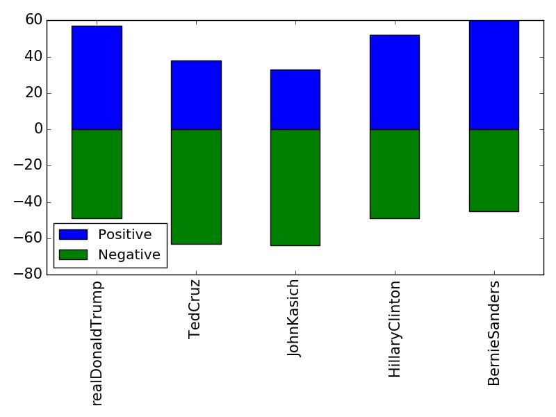
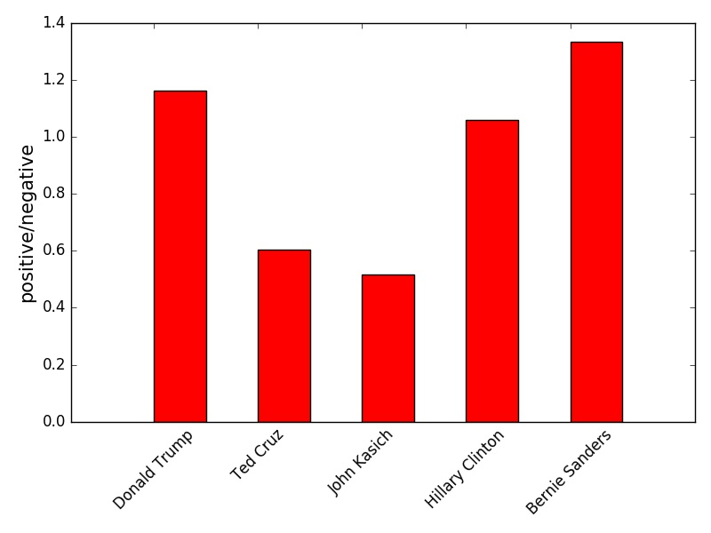
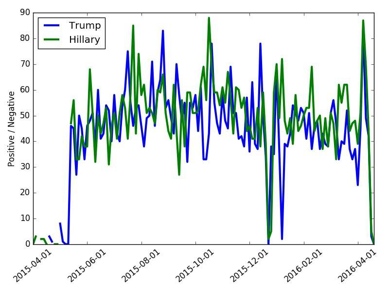

# Twitter_analysis_GOP
Using twitter data to see how positive and negative attitude to GOP candidates

File GOP_now.py is for present tweets analysis (collection 120 tweets for each candidate, then clean them, and pick out positive words and negatibve words  and ratio of positive/negative words 

File GOP_old.py is for last one year tweets (100 tweets were collected each day) for candidate Hillary Clinton and Donald Trump 

